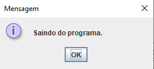

# Conversor de Moedas e Temperatura

Ao iniciar o aplicativo, o usuário é apresentado a um menu de opções:

"Converter moeda"
"Converter temperatura"
"Sair"
Se o usuário escolher "Converter moeda," ele será apresentado a outro menu com opções para conversão de moeda, onde pode selecionar uma das seguintes opções:

"Reais para Dólar"
"Dólar para Reais"

O usuário insere o valor a ser convertido e recebe o resultado da conversão em uma caixa de diálogo.

Se o usuário escolher "Converter temperatura," ele será apresentado a outro menu com opções para conversão de temperatura, onde pode selecionar uma das seguintes opções:

"Celsius para Fahrenheit"
"Fahrenheit para Celsius"

O usuário insere a temperatura a ser convertida e recebe o resultado da conversão em uma caixa de diálogo.

O usuário pode repetir as conversões quantas vezes desejar ou escolher "Sair" para encerrar o aplicativo.

# Notas Adicionais

O aplicativo utiliza caixas de diálogo do JOptionPane para interagir com o usuário, permitindo uma experiência de usuário mais amigável.
As taxas de câmbio usadas nas conversões de moeda são fictícias e devem ser substituídas por valores reais, se necessário.
As fórmulas de conversão de temperatura são as fórmulas padrão para as respectivas conversões.
O aplicativo pode ser personalizado e expandido para adicionar funcionalidades adicionais, como atualização automática das taxas de câmbio ou um histórico de conversões.
Esta documentação fornece uma visão geral do fluxo do aplicativo e das principais funcionalidades do projeto de conversor de moeda e temperatura em Java. Você pode aprimorar e personalizar esta documentação conforme necessário para atender aos requisitos do seu projeto.

